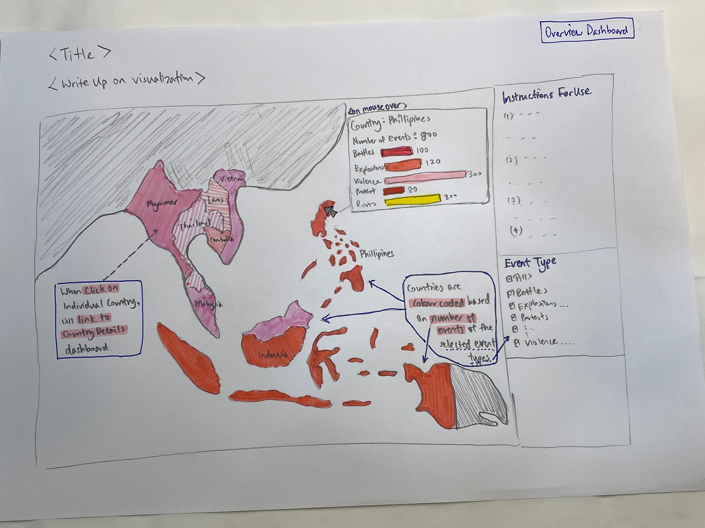
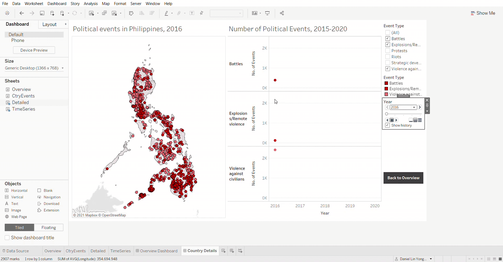

```{r setup, include=FALSE}
knitr::opts_chunk$set(echo = FALSE)

# Learn more about creating blogs with Distill at:
# https://rstudio.github.io/distill/blog.html

```

# Background

A data visualization was created to reveal the spatio-temporal patterns of armed conflict in selected South-east Asia countries between 2015 to 2020. The visualization is based on data provided by The Armed Conflict Location & Event Data Project (ACLED) at https://acleddata.com/#/dashboard.

The purpose of this post is to critique the current visualization and to propose an alternative visualization and interactive techniques to improve the current design.

### Contents
[A. Critique of Data Visualization Provided](#PartA)<br>
[B. Proposed Alternative Visualization and Interactive Techniques](#PartB)<br>
[C. Proposed Data Visualization](#PartC)<br>
[D. Preparation of Data Visualization](#PartD)<br>
[E. Key Observations from the visualization prepared](#PartE)<br>


# A. Critique of Data Visualization Provided
<a name="PartA"></a>
The original visualization created is shown below.

```{r pressure, echo=FALSE, fig.cap="Original Data Visualization", out.width = '100%'}

```

Based on the original data visualization provided, the following are some comments on the clarity, aesthetics and interactivity aspects of the visualization.


## Clarity

**1. Spatial boundary of the selected country is not obvious.**<br>While the title of the graph on the left specifies the country selected, the area occupied by the selected country is not evident on the map. A darker boundary or highlight of the region to make it more prominent will allow the reader to be better able to visualize the area occupied by the selected country.

**2.Vertical axis label of the time series charts is not appropriate.**<br>Currently the axis is labelled as “Count of Sheet 1” which is not an appropriate labelling for the vertical axes of the time series charts on the right. A more appropriate label could be “Number of Occurrences”.

**3. Time series charts on the right did not indicate clearly which region or country the data represented is for.**<br>There is no clear indication whether the time series charts on the right represented data of the selected country, the entire region (all Southeast Asian countries) or even the world.

**4. Overview of Country Events needed.**<br>
Currently the visualization provides a detailed view of the locations of occurrence of political events of each country. An overview of the occurrences of political events of each country would allow for easy inter-country comparison.

**5. No write-up to provide a context to the visualization.**<br>
There should have been a brief write-up to provide the user some context to the visualization and the key messages to take away from the visualization. 

## Aesthetics

**1. Colours used to represent the events should be consistently applied across charts.**<br>
For the time series charts on the right, the colours used for the time graphs should be consistent with the colour scheme selected for the various event types for the geospatial chart on the left.

**2. Labels of events could be of a stronger colour and bolded**<br>
The event types of the time series charts on the right should be labelled more prominently (either via a darker colour or bolded).

**3. Selected country name peppered by dot plots.**<br>
For the country that is selected, dots representing events are plotted on the map on the left. However in doing so, the name of the country is covered over by the dots and the name of the country is not legible. Although the name of the country selected is still visible in the title, it would be aesthetically more pleasing to either have the name of the country removed or placed in such a way that it is not within the area of the selected country.

**4. Colours of events to correspond to event categories as defined by ACLED**<br>
Colours selected for event types could correspond to different categories of event types with events within each category (i.e. Violent Events, Demonstration Events, Non-Violent Events) being of the same colour but in different hues. This will allow users to get an indication at first glance on the nature of the main types (categories) of events that have taken place in various countries.

## Interactivity

**1. Visualization allows user to select individual countries for viewing.**<br>
This is good as users will most likely want to view and compare events and occurrences of and between countries. Assuming that the chart on the right changes and corresponds to the country selected, the user is also able to visualize the developments of events over time for various countries. This feature should be included if not already so.

**2. Visualization should allow user to select desired time periods to be displayed.**<br>
The visualization should provide interactivity for the user to select the time periods for which the data is displayed, for deeper analysis of changes in events over time. Both the spatial chart and line charts should respond to changes in selected time periods and display the relevant data.

**3. Visualization could allow data of multiple selected countries to be displayed.**<br>
The visualization should be able to allow the user to view the data for multiple selected countries in the event that comparison between countries is desired. For the time series chart on the right, individual countries’ data should be a different line series.

**4. Details of sub-regions to be displayed on mouse-over.**<br>
When user mouse-overs a particular sub-region of the selected country, details specific to the sub-region (e.g. sub-region name, number of various events taken place during the time period) should appear. This will provide greater understanding of how the occurrence of events are distributed geographically within the selected country.


# B. Proposed Alternative Visualization and Interactive Techniques
<a name="PartB"></a>

## Description of and Rationale for Proposed Visualization

The visualization is designed to have 2 dashboards, an Overview dashboard of countries involved in the data, and a Country Details dashboard to allow in depth view of events by country.<br>

## 1. Overview Dashboard

```{r pressure1, echo=FALSE, fig.cap="Sketch of proposed Overview dashboard", out.width = '100%'}

```

**1. Overview Dashboard to provide users with context of the data.**<br>
By providing users with an Overview Dashboard at the start, together with a short write-up, users will have a clearer understanding on what is the context of the data, and how to use the visualization to glean useful insights.

An Instructions for Use panel will also be provided for Users to be familiar on how to navigate between the dashboards.<br>

**2. Filter for Event Types to allow users an overview of the occurrences of various events in different countries**<br>
A filter to select different event types will be provided so that users are able to select event types of interest and have an overview of which event types have taken place more frequently in different countries as reflected by darker hues of red. 

Red was selected as the main colour to represent the frequency of events taking place in the countries since the events mainly involve conflicts and sometimes violence. 

For example, when user selects event types that are Demonstration Events (i.e. Protests and Riots), and if countries such as Indonesia will be shaded in darker hues of red, this means that Indonesia has greater numbers of Demonstration Events compared to the other countries. Conversely, if Violent Events (i.e. Battles, Explosions/Remote Violence, Violence against civilians) is selected, countries like Myanmmar or Cambodia will likely be coloured in darker hues of red compared to countries like Malaysia, indicating that there is a higher frequency of such events in countries like Myanmmar and Cambodia.

**3. Frequency of occurrence of each Event Type in each country is shown when moused-over individual countries**<br>
The user will be able to have a view of the occurrences of events by event types in each country when he mouses-over the corresponding countries. A bar chart indicating the number of instances of event type will be provided in the mouse-over tooltip window.  

**4. Link to Country Details dashboard**<br>
To get more in depth view of the events that have taken place in each country, the user will click on the country in the map and will be brought to the Country Details dashboard to visualize the details by country selected.<br>

## 2. Country Details Dashboard

```{r pressure2, echo=FALSE, fig.cap="Sketch of proposed Country Details dashboard", out.width = '100%'}

```
**5. Geo-spatial plot of every event allows users to observe any geo-spatial patterns in events**<br>
Every event is plotted on the map on the left and colour coordinated with its event type. Users will be able to do a visual observation on whether there are any patterns in the geographical distribution of the events by event types for the selected country.<br>

**6. The line graphs on the right show the number of instances for each event type for the specified years**<br>
The line graphs on the right display the numbers of events by event types that had occurred year to year for the selected country.

**7. Tool for viewing the data year by year will allow users to observe the changes and developments in events over time.**
By including a tool to allow users to playback or step through manually each year, while observing the corresponding points on the map and line charts, users may be able to spot temporal or spatial patterns in the data.

**8. Inclusion of event details in the tooltips.**<br>
Tooltips will be created so that when users mouse-over each event on the map, the event details such as location of the event, number of fatalities and notes of the events are displayed.

# C. Proposed Data Visualization
<a name="PartC"></a>

The proposed data visualization is found at the following URL:<br>
*https://public.tableau.com/profile/daniel.lin.yongyan#!/vizhome/DatavizMakeover3_16162605639950/OverviewDashboard?publish=yes*
<br><br>

A **screenshot** of the dashboards are as follow.

```{r pressure3, echo=FALSE, fig.cap="Proposed Overview dashboard", out.width = '100%'}

```

```{r pressure4, echo=FALSE, fig.cap="Proposed Country Details dashboard", out.width = '100%'}

```

# D. Preparation of Data Visualization
<a name="PartD"></a>

## D1. Preparation of Dataset

### D1.1 Selection of variables from ACLED dataset provided

The following variables were removed using EXCEL (right-click columns > delete) as they would not be used in the visualization – TIME_PRECISION, REGION and TIMESTAMP. 

```{r pressure18, echo=FALSE, fig.cap="Removed TIME_PRECISION", out.width = '100%'}

```

```{r pressure19, echo=FALSE, fig.cap="Removed REGION", out.width = '100%'}

```

```{r pressure20, echo=FALSE, fig.cap="Removed TIMESTAMP", out.width = '100%'}

```

### D1.2 Importing of dataset to Tableau

The above saved dataset was imported to Tableau by dragging from Windows Explorer to Tableau as shown below.

```{r pressure21, echo=FALSE, fig.cap="Import dataset to Tableau", out.width = '100%'}
knitr::include_graphics("D1_2a.png")
```

### D1.3 Changing variables to the correct data types

Some of the variables in the imported dataset were not classified as the correct datatypes. The following variables were re-classified accordingly as shown below.

* Year – classified as Date type

```{r pressure22, echo=FALSE, fig.cap="Reclassify YEAR to Date type", out.width = '100%'}

```

* Admin1, Admin2, Admin3 and Location – assigned with Geographic Role as State/Province. 

```{r pressure23, echo=FALSE, fig.cap="Assign LOCATION with Geographic Role as State/Province", out.width = '100%'}

```

More importantly was to check that Latitude and Longitude variables had been assigned their correct geographic roles.

```{r pressure24, echo=FALSE, fig.cap="Check Latitude has been assigned Geographic Role > Latitude", out.width = '100%'}

```

```{r pressure25, echo=FALSE, fig.cap="Check Longitude has been assigned Geographic Role > Longitude", out.width = '100%'}

```


# E. Key Observations from the visualization prepared
<a name="PartE"></a>

**1. Philippines has the most occurrences of political events while Laos has the least.**<br>
Philippines has the greatest number of political events while Laos has the lowest number of political events as seen in the following screenshot below where Philippines has the darkest hue of red and Laos has the lightest hue.

```{r pressure6, echo=FALSE, fig.cap="Colour intensity reflecting number of political events", out.width = '100%'}

```

**2. Philippines has the greatest number of Violent events, followed by Myanmar and Thailand.**<br>
Based on the Overview dashboard, Philippines has the greatest number of violent events (i.e. Battles, Explosions / Remote violence, and Violence against civilians), followed by Myanmar and Thailand. This is observed from the colour intensities of the mentioned countries in comparison to their neighbours when the Violent Events have been selected in the Event Type filter.

```{r pressure7, echo=FALSE, fig.cap="Philippines has most number of Violent Events", out.width = '100%'}

```

Interestingly, the most frequent type of Violent Event is different for the 3 mentioned countries.
For Philippines, the most frequent type of Violent Event is Violence against civilians as seen below.

```{r pressure8, echo=FALSE, fig.cap="Main violent event type is Violence against civilians", out.width = '100%'}

```

For Myanmar, the most frequent type of Violent Event are Battles.

```{r pressure9, echo=FALSE, fig.cap="Main violent event type is Battles", out.width = '100%'}

```

Whereas for Thailand, the most frequent Violent Event type is Explosions / Remote Violence.

```{r pressure10, echo=FALSE, fig.cap="Main violent event type is Explosions / Remote Violence", out.width = '100%'}

```

**3. In terms of Demonstration Events, Indonesia had the most followed by Myanmar, while Laos had the least. Protests made up the main component of Demonstration Events.**<br>
From the Overview dashboard, when Demonstration Events (Protests and Riots) were selected, it is observed that Indonesia had the greatest number of such events since it had the darkest hue of red, followed by Myanmar. Laos once again had the lightest hue and hence the lowest number of Demonstration Events.

```{r pressure11, echo=FALSE, fig.cap="Indonesia had most number of Demonstration Events", out.width = '100%'}
knitr::include_graphics("E3a.jpg")
```

When moused-over Indonesia, it is observed that the majority of Demonstration Events is made up of Protests with number of Riots being about one fifth as much as number of Protests.

```{r pressure12, echo=FALSE, fig.cap="Majority of Demonstration events are Protests", out.width = '100%'}

```

The same trend is observed in the other countries, which can be observed when we mouse-over the other countries.

```{r pressure17, echo=FALSE, fig.cap="Majority of Demonstration events are Protests", out.width = '100%'}
knitr::include_graphics("E3c.gif")
```

**4. In the Philippines, the number of Violent Events decreased over time, mainly led by the fall in incidents involving Violence against civilians and mainly in the Northern region.**<br>
From the Country Details dashboard, we are able to view the drop in Violent Events over time was mainly due to the fall in Violence against civilians as shown.

```{r pressure13, echo=FALSE, fig.cap="Number of Violent Events fell over time", out.width = '100%'}

```

From the dashboard, when we step through year by year from 2016 to 2020, it is observed that there is an easing up on violent events in the North, more so than the South as shown below.

```{r pressure14, echo=FALSE, fig.cap="Number of Violent Events fell over time", out.width = '100%'}

```

**5. Number of Demonstration Events in Indonesia fell initially before climbing significantly from 2017.**<br>
The number of Demonstration Events (i.e. Protests and Riots) in Indonesia had a falling trend from 2015 to 2017 but experienced a sharp increase from 2017 to 2020 and this increase is led mainly by the large increase in the numbers of Protests as shown below.

```{r pressure15, echo=FALSE, fig.cap="Number of Demonstration Events fell before rising sharply", out.width = '100%'}

```

In terms of geographical patterns of the Demonstration Events, there was a slight shift over time in the concentration of incidents from the Southern Island of Java, outwards towards the Western island of Sumatra, Northern Island of Sulawesi and Western New Guinea in the East as shown below.

```{r pressure16, echo=FALSE, fig.cap="Outward shift in concentration of Demonstration Events", out.width = '100%'}

```


