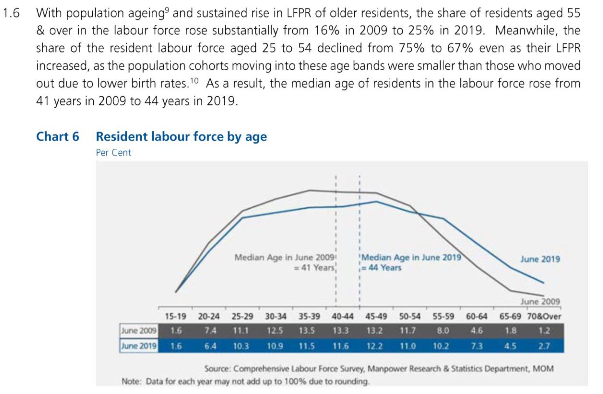

```{r setup, include=FALSE}
knitr::opts_chunk$set(echo = FALSE)

# Learn more about creating blogs with Distill at:
# https://rstudio.github.io/distill/blog.html

```

# A. Critique of Data Visualization Provided

Based on the original data visualization provided, the following are some comments on the clarity and aesthetics aspects of the visualization.

```{r pressure, echo=FALSE, fig.cap="Provided Data Visualization", out.width = '100%'}

```

## Clarity
| **S/N** | **Comments**                                                                                                                                                                                                                                                                                                                                                                                                                                                                                                  |
|-----|-----------------------------------------------------------------------------------------------------------------------------------------------------------------------------------------------------------------------------------------------------------------------------------------------------------------------------------------------------------------------------------------------------------------------------------------------------------------------------------------------------------|
| 1   | **Title is not well worded**<br>The title of the chart should provide the reader with an overview of the key message of the chart and not merely mention the data and axes plotted (E.g. Resident labour force by age).                                                                                                                                                                                                                                                                                   |
| 2   | **No vertical axis and labels for both axes**<br>While the title mentioned that the chart reflected Resident Labour Force by Age, it did not specify what the vertical axis represented or how it was computed. Even though there were values provided in the table below the graph, it was not clear if the line graphs were plotted based on those values. There was also no mention on what the values in the table were or how they were computed. The reader is left guessing what the values meant. |
| 3   | **Improper use of line graphs**<br>Line graphs are usually used to display trends in data over time, presenting several data points as one continuous evolution.  In this case, bar graphs would be more appropriate for comparing the data across various age-bands which are categorical.                                                                                                                                                                                                               |
| 4   | **Lack of annotations and use of data-ink to tell data story and emphasize key messages**<br>The writeup provided mentioned that the share of resident labour force within 2 age bands, 25-54 and 55 & over, had fallen and risen, respectively. However, this is not immediately evident from the chart since there are no annotations or use of data-ink to guide the reader to the main message.                                                                                                       |
| 5   | **Only 2 time points provided for comparison**<br>The chart only provides data at 2 time points, 2009 and 2019. Without the data points in between 2009 and 2019, the reader is not able to tell if there are any particular trends in the data or if the increase or decrease mentioned is a once off comparison.                                                                                                                                                                                        |
| 6   | **Inclusion of data table adds to chart clutter**<br>By including the data table in the chart, the chart appears more cluttered and the reader will find himself distracted, having to cross reference between the points on the line graph and the corresponding values in the table.                                                                 

## Aesthetics

| **S/N** | **Comments**                                                                                                                                                                                                                                                                                                                                                                     |
|---------|----------------------------------------------------------------------------------------------------------------------------------------------------------------------------------------------------------------------------------------------------------------------------------------------------------------------------------------------------------------------------------|
| 1       | **Colour chosen does not contrast sufficiently with the background**<br>The colour chosen for the 2009 line does not contrast sufficiently with the background and does not stand out easily. A more contrasting colour should be chosen to make the line more easily seen. Alternatively, a white background would have allowed the lines graphs to stand out more prominently. |
| 2       | **Consistent use of colours**<br>Colours used to denote and label the line and data for 2009 (in grey) and 2019 (in blue) have been consistently applied. This allows for easier reference between the set of data in the table and the line graph, though not ideal as mentioned in point 1.                                                                                    |
| 3       | **Elimination of legend**<br>To reduce chart clutter, a legend for the chart was not used. Instead, the line graphs were labelled directly.                                                                                                                                                                                                                                      |
| 4       | **Use of tick marks to demarcate age-bands on the horizontal axis.**<br>Tick marks are usually not used on a categorical scale but more for continuous scales. However in this chart, since a line graph was used for a categorical scale, tick marks were appropriately used to demarcate the age bands on the horizontal axis.                                                 |
| 5       | **Good choice of font type, size and colour**<br>Font type, size and colour selected in the chart is an appropriate choice as it is easily read by the reader. However, to emphasize key messages of the chart, annotations of different size and colour could be used.           


