```{r setup, include=FALSE}
knitr::opts_chunk$set(echo = FALSE)

# Learn more about creating blogs with Distill at:
# https://rstudio.github.io/distill/blog.html

```

# A. Critique of Data Visualization Provided

Based on the original data visualization provided, the following are some comments on the clarity and aesthetics aspects of the visualization.

```{r pressure, echo=FALSE, fig.cap="Provided Data Visualization", out.width = '100%'}
knitr::include_graphics("OriginalGraph.jpg")
```

## Clarity
| **S/N** | **Comments**                                                                                                                                                                                                                                                                                                                                                                                                                                                                                                  |
|-----|-----------------------------------------------------------------------------------------------------------------------------------------------------------------------------------------------------------------------------------------------------------------------------------------------------------------------------------------------------------------------------------------------------------------------------------------------------------------------------------------------------------|
| 1   | **Title is not well worded**<br>The title of the chart should provide the reader with an overview of the key message of the chart and not merely mention the data and axes plotted (E.g. Resident labour force by age).                                                                                                                                                                                                                                                                                   |
| 2   | **No vertical axis and labels for both axes**<br>While the title mentioned that the chart reflected Resident Labour Force by Age, it did not specify what the vertical axis represented or how it was computed. Even though there were values provided in the table below the graph, it was not clear if the line graphs were plotted based on those values. There was also no mention on what the values in the table were or how they were computed. The reader is left guessing what the values meant. |
| 3   | **Improper use of line graphs**<br>Line graphs are usually used to display trends in data over time, presenting several data points as one continuous evolution.  In this case, bar graphs would be more appropriate for comparing the data across various age-bands which are categorical.                                                                                                                                                                                                               |
| 4   | **Lack of annotations and use of data-ink to tell data story and emphasize key messages**<br>The writeup provided mentioned that the share of resident labour force within 2 age bands, 25-54 and 55 & over, had fallen and risen, respectively. However, this is not immediately evident from the chart since there are no annotations or use of data-ink to guide the reader to the main message.                                                                                                       |
| 5   | **Only 2 time points provided for comparison**<br>The chart only provides data at 2 time points, 2009 and 2019. Without the data points in between 2009 and 2019, the reader is not able to tell if there are any particular trends in the data or if the increase or decrease mentioned is a once off comparison.                                                                                                                                                                                        |
| 6   | **Inclusion of data table adds to chart clutter**<br>By including the data table in the chart, the chart appears more cluttered and the reader will find himself distracted, having to cross reference between the points on the line graph and the corresponding values in the table.                                                                 

## Aesthetics

| **S/N** | **Comments**                                                                                                                                                                                                                                                                                                                                                                     |
|---------|----------------------------------------------------------------------------------------------------------------------------------------------------------------------------------------------------------------------------------------------------------------------------------------------------------------------------------------------------------------------------------|
| 1       | **Colour chosen does not contrast sufficiently with the background**<br>The colour chosen for the 2009 line does not contrast sufficiently with the background and does not stand out easily. A more contrasting colour should be chosen to make the line more easily seen. Alternatively, a white background would have allowed the lines graphs to stand out more prominently. |
| 2       | **Consistent use of colours**<br>Colours used to denote and label the line and data for 2009 (in grey) and 2019 (in blue) have been consistently applied. This allows for easier reference between the set of data in the table and the line graph, though not ideal as mentioned in point 1.                                                                                    |
| 3       | **Elimination of legend**<br>To reduce chart clutter, a legend for the chart was not used. Instead, the line graphs were labelled directly.                                                                                                                                                                                                                                      |
| 4       | **Use of tick marks to demarcate age-bands on the horizontal axis.**<br>Tick marks are usually not used on a categorical scale but more for continuous scales. However in this chart, since a line graph was used for a categorical scale, tick marks were appropriately used to demarcate the age bands on the horizontal axis.                                                 |
| 5       | **Good choice of font type, size and colour**<br>Font type, size and colour selected in the chart is an appropriate choice as it is easily read by the reader. However, to emphasize key messages of the chart, annotations of different size and colour could be used.           

# B. Proposed Alternative Data Visualization

## Sketch of Proposed Visualization
```{r pressure1, echo=FALSE, fig.cap="Sketch of Proposed Data Visualization", out.width = '100%'}
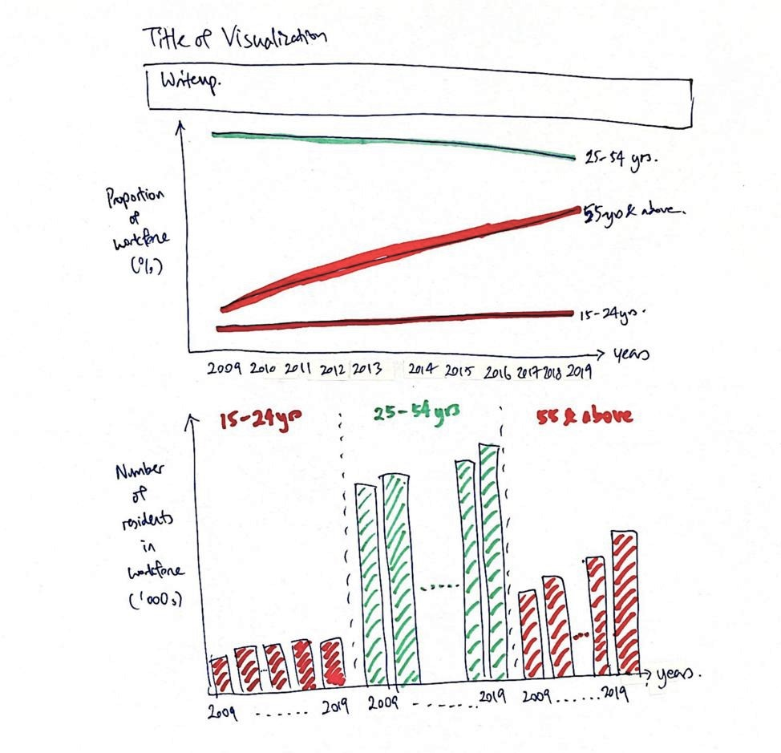
```

## Advantages and Reasons for Proposed Design
**1. Use of suitable Title and Write-up**
<br>
The title and write-up provides context to the visualization and helps the reader zoom in and focus on the key messages and relevant portions of the chart

**2. Use of vertical axis and appropriate axes labels**
<br>
The inclusion of both axes and axes labels allows the reader to have clarity and understand what is depicted in the chart.

**3. Data points between 2009 to 2019 provided**
<br>
The initial provided graph only provided a comparison between 2 years, 2009 and 2019. The increase observed between the 2 years could be a once off and it would not be possible to observe it there was a trend in the data. However, by including the years in between 2009 and 2019, trends in the data can be observed.

**4. Appropriate use of Line Graphs**
<br>
The line graphs used in the top chart allows the reader to visualize trends more easily, since the lines present several data points as one continuous evolution over time. Bar charts were selected for the bottom chart to provide a more visual impact of the absolute numbers of residents in the workforce,for each of the age groups.

**5. Use of annotations to highlight key points**
<br>
Annotations in the chart were used to draw readers' attention to the key points mentioned in the write-up. This is to allow readers to quickly understand the focus of the charts.

**6. Exclusion of Data Table**
<br>
In the original visualization, a data table was included. This contributed to chart clutter and reduced the clarity of the chart. In the proposed design, data tables were not included but important values were highlighted using annotations where necessary.

**7. Selection of colours and fonts to facilitate the reading of charts**
<br>
The background was kept a consistent white colour, while the colours of text and chart elements were selected to be of a striking colour. This is to allow the reader to more easily read and view the chart elements. Elements which are not key are kept to a lighter shade to reduce distraction from the main elements.

**8. Elimination of legends**
<br>
The use of appropriate labels for the charts meant that there was no need for chart legends as readers can easily identify which age bands the chart elements belonged to. This helped to reduce chart clutter.

**9. Consistent use of colours**
<br>
Colours chosen were consistently applied to elements relating to the same age groups to allow easy referencing by readers and to avoid confusion.


# C. Proposed Data Visualization
The proposed data visualization is found at the following URL:<br>
*https://public.tableau.com/profile/daniel.lin.yongyan#!/vizhome/DataVizMakeover1_16118057789510/Dashboard?publish=yes*
<br><br>
A **screenshot** of the visualization is as follow.<br>
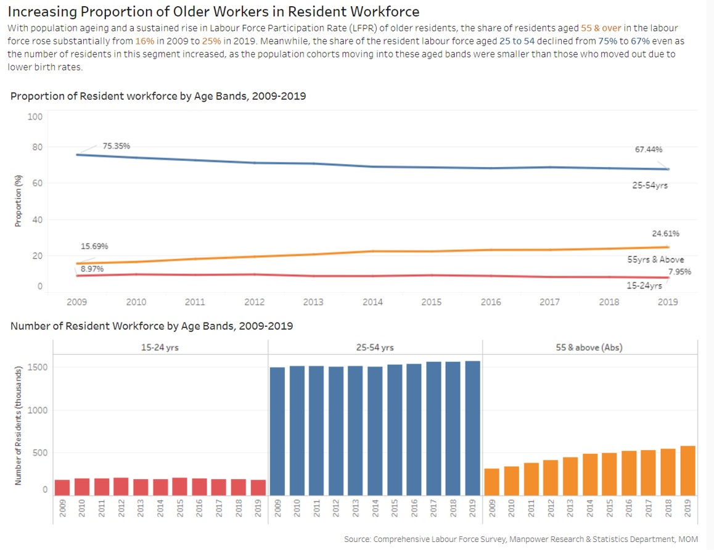
<br>

# D. Preparation of Data Visualization

## (1) Derivation of Data from MOM's website
The data used for the visualization was obtained from the Ministry of Manpower's (MOM) website (https://stats.mom.gov.sg/Pages/Labour-Force-Tables2019.aspx). Of the tables provided, Table 7 (Resident Labour Force Aged Fifteen Years and Over by Age and Sex, 2009 - 2019 (June)) was used for the data visualisation.
<br>
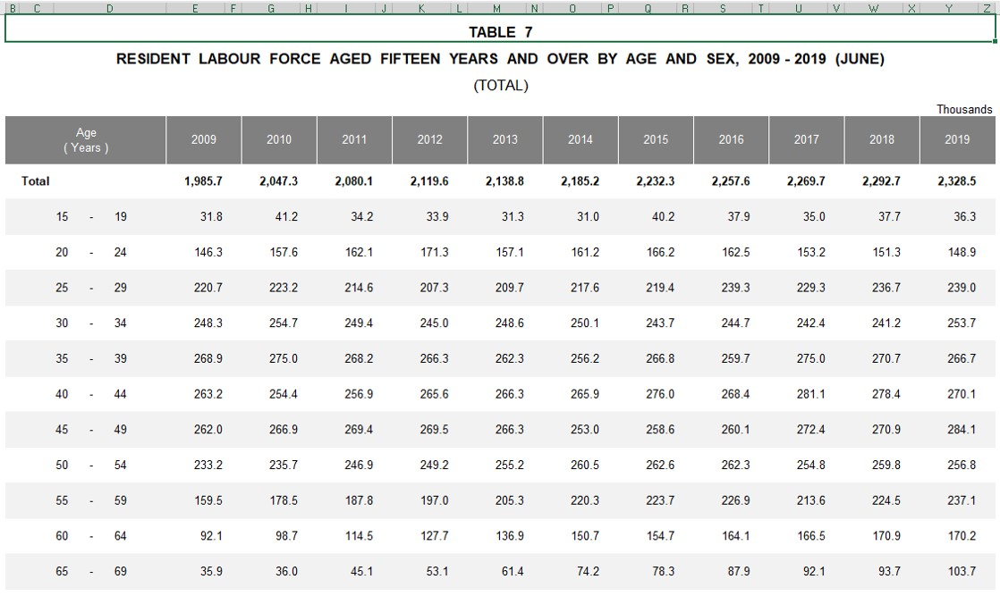

## (2) Data cleaning and preparation

Table 7's data provided the number of residents who were in the resident labour force by 5 year age bands. To prepare the data for analysis, empty columns in the table were removed, and data for the desired age bands (i.e. 15-24yrs, 25-54yrs, 55yrs and above) were derived.
A screenshot of the derived table and relevant formulae are as shown below.<br>
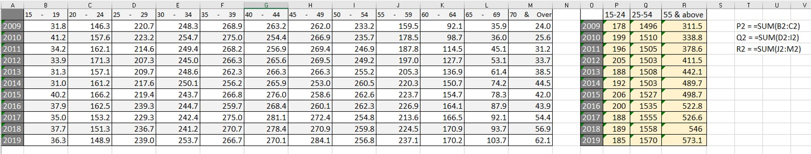
The formula used are <br>
P2 = =SUM(B2:C2) <br>
Q2 = =SUM(D2:I2) <br>
R2 = =SUM(J2:M2) <br>

To derive the data for the second chart where Proportion of residents in the workforce for the respective age bands, the following is a screenshot of the derivation carried out.<br>
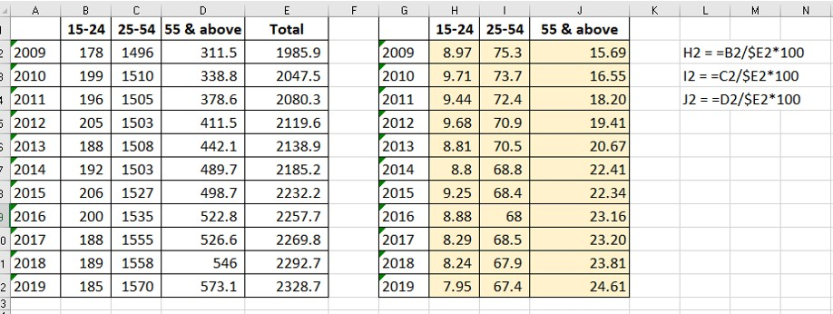
<br>

## (3) Import Data to Tableau

The Excel spreadsheet with the created tables were imported in to Tableau as shown below.<br><br>
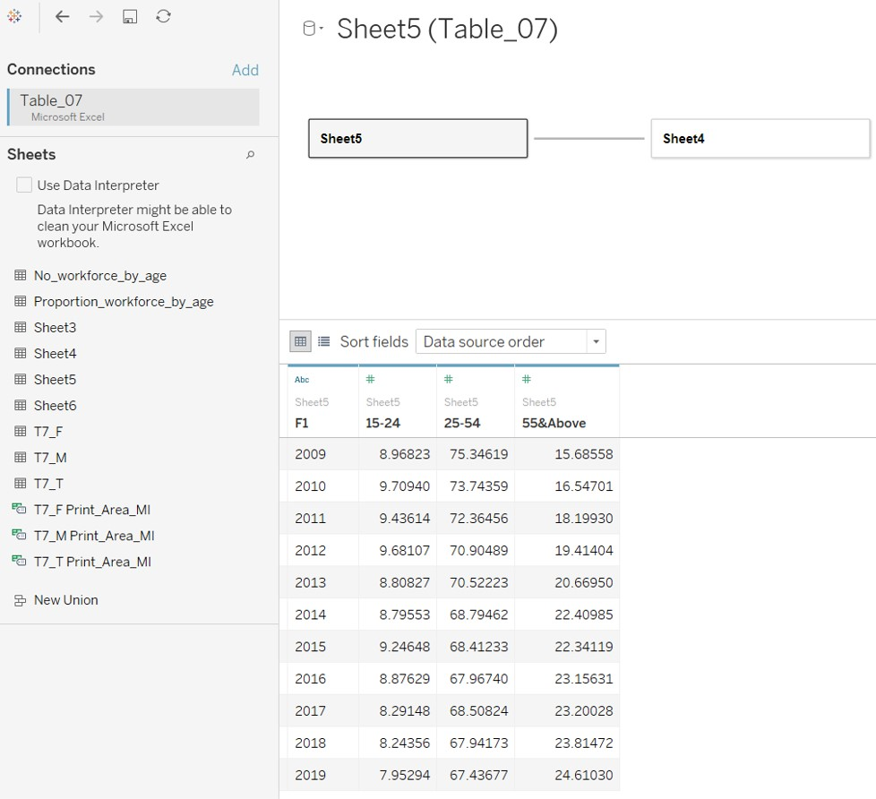
<br>

## (4) Creation of Visualization - Line Graph

After importing the data to Tableau, I started with the creation of the visualization for Proportion of Workforce.<br>
* Years (named F1 here) was dragged to the Columns field
* (15-24), (25-54), and (55&Above), which contained the proportion data, were dragged to the Rows field.
* Measure Names was also placed in the Filters field and Colour panel.
<br>
The resulting chart is shown as follow.
<br>
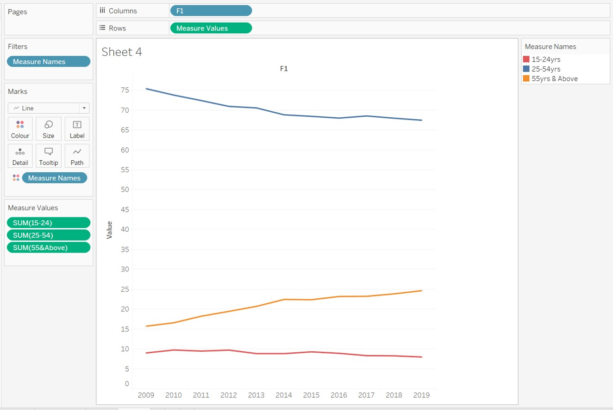
<br>
To remove the legend, the line graphs needed to be labelled. This is done by
* Bringing Measure Names onto the Label panel, and clicking on the Label panel
* Indicating <Measure Names> in the Text field
* Selecting Line Ends and checking Label End of Lines
<br>
The following is a screenshot of the step. 
<br>
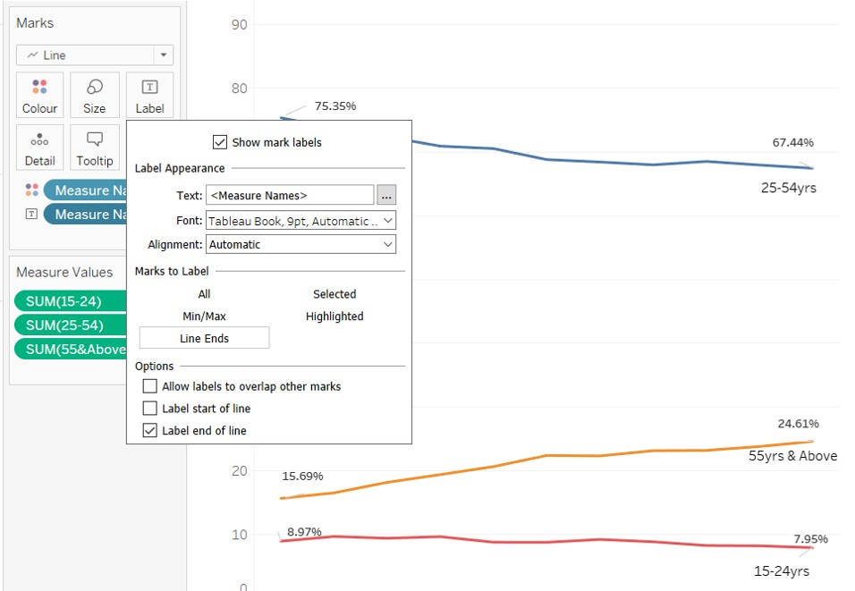
<br>
The 2 end points of the line graphs were also annotated to allow the reader to easily view and to reinforce the points mentioned in the write-up. This is done by <br>
* Right-clicking on the point
* Select Annotate Mark
* Input as shown below.
<br>
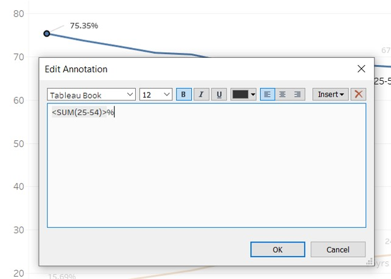
<br>
The title is also updated as follows.
<br>
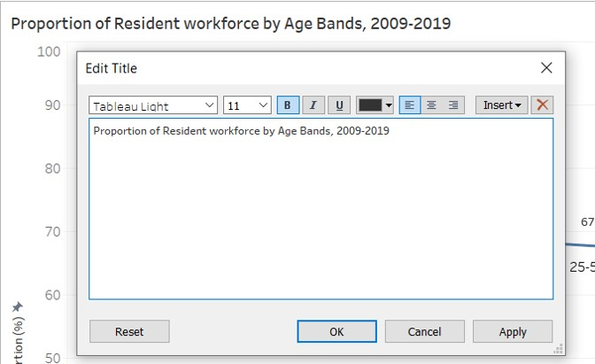
<br>
Next was to fix the Proportion (vertical) axis to 100 to provide an indication of the proportion out of 100%. This is done by right clicking on the vertical axis and selecting Fixed in the dialog box as shown. 
<br>
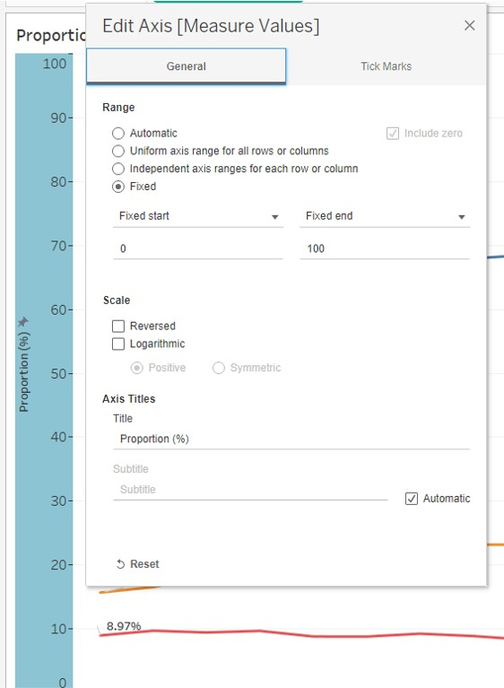
<br>
The following is the final Line Graph prepared. 
<br>
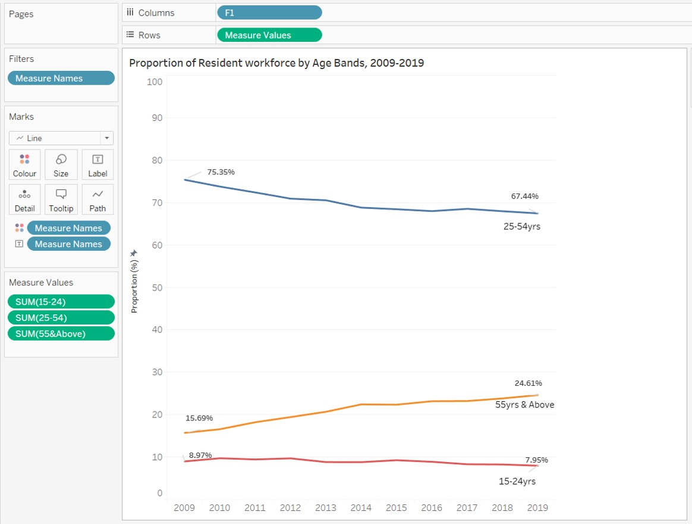
<br>


