```{r setup, include=FALSE}
knitr::opts_chunk$set(echo = FALSE)

# Learn more about creating blogs with Distill at:
# https://rstudio.github.io/distill/blog.html

```

# Background
A research team has conducted a study to understand the receptivity of the public towards COVID-19 vaccination. As part of their study, data from the Imperial College London YouGov COVID-19 Behaviour Tracker Data Hub was utilised. From the data obtained, some visualizations were created. The aim of this post is to provide suggestions for improvement of the visualizations as well as to propose other visualizations for further analysis of the data to allow deeper insights to be gleaned.

# A. Critique of Data Visualization Provided

The original visualizations created by the team is shown below.


```{r pressure, echo=FALSE, fig.cap="Provided Data Visualization", out.width = '100%'}
knitr::include_graphics("OriginalVisual.jpg")
```

Based on the original data visualization provided, the following are some comments on the clarity and aesthetics aspects of the visualization.


## Clarity
**1.    Titles of the charts and legends are not well worded**<br>
The title of the chart on the left could have been better phrased to reflect the content and key message of the chart. <br>
The horizontal axes could have been better labelled to “Proportion of respondents”. <br>
For the vertical axes, it is unnecessary to have the “Country” axis label as the country labels are self-explanatory. <br>
For the legend, there is no need to label “Vac1” as it is not meaningful to the reader. <br><br>
**2.    Colour chosen for categories not intuitive**<br>
Colours selected to represent the categorical responses should reflect the nature of the responses. <br>
For example, Strongly agree (1) and Agree (2) should be of the same colour hue but different in tones/shades to reflect intensity (i.e. (1) should be darker/more intense than (2)). Similarly, Strongly Disagree (5) and Disagree (4) should be of the same colour hue but of different tones/shades to reflect intensity (i.e. (5) should be more intense then (4)).<br>  
<br>
**3.    Uncertainty in the data was not represented**<br>
For the chart on the right, since sample proportion was used, confidence intervals of the sample proportion should be included to allow readers to understand the margin of error in the sample estimates and to interpret if the proportions reflected are statistically different. <br><br>

**4.    Inclination and skew of responses not easily observed with 100% stacked bar chart**<br>
While the 100% stacked bar chart demonstrates the proportions of the responses for each country, it does not intuitively show the skew and inclination of the responses for each country at a glance. With a diverging stacked bar chart, the inclinations of the responses is more evident. <br><br>
**5.    Insufficient data to draw meaningful observations**<br>
Both charts essentially reflect countries' receptivity towards the COVID-19 vaccine. However, no further observations and analysis are available from the charts. In order to glean deeper insights, the data from the variable used (var_1) should be compared with data from other variables for analysis.     <br><br>

**6.    Bar chart on the right sorted in descending order**<br>
For the chart on the right, countries are sorted in descending order of the proportion of the public which had strongly agreed to the statement that they were willing to take the vaccine. By arranging in this manner,it allows easier identification of countries which had a higher receptivity towards the vaccine.

## Aesthetics

**1.    Horizontal arrangement of the bar chart**<br>
As the bar charts are labelled according to country names, a horizontal mapping of the bar chart allows the countries’ names to be seem in full and in a less cluttered manner than if arranged in a vertical layout. <br><br>
**2.    Country names should be in Title Case instead of lowercase**<br>
Country names are proper nouns and should be in Title Case instead of the current lowercase used. <br><br>
**3.    Consistent use of colours**<br>
There was consistent use of colours in both graphs, where dark blue was used to represent the proportion of respondents who had strongly agreed.<br><br>
**4.    Consistency in number of decimals on horizontal axes**<br>
The chart on the left used whole number labels while the one on the right had labels with 1 decimal place. For consistency and for the charts to look less cluttered, whole number labels could be used.<br><br>
**5.    Good choice of font type, size and colour**<br>
Font type, size and colour selected in the chart is an appropriate choice as it is easily read by the reader. However, to emphasize key messages of the chart, annotations of different size and colour could be used.           


# B. Proposed Alternative Data Visualization

## Sketch of Proposed Visualization
```{r pressure1, echo=FALSE, fig.cap="Sketch of Proposed Data Visualization", out.width = '100%'}
knitr::include_graphics("Sketch.jpg")
```

## Description of and Rationale for Proposed Visualization

**1.    Side by side comparison of responses to different questions**<br>
The proposed visualization would include 2 graphs placed side by side with readers having an option to select the questions (variables) for which the charts are representing. This will allow users to compare responses to the different questions and derive deeper insights into the responses.

For example, for a country with high proportion of public willing to take the vaccine, a comparison with their responses to other questions such as "I am worried about getting COVID19" or "I believe government authorities in my country will provide me with an effective COVID19 vaccine" could provide deeper understanding on the motivation of respondents' receptivity towards vaccination. Application wise, public health authorities would be able to determine if there were any public health messaging that would drive vaccination uptake more than others.

**2.    Filters by demographical factors to allow deeper analysis**<br>
There are also filters for the chart on the left, to allow users to refine the charts displayed by gender, age range, employment status, household size and number of children in households, which may provide interesting insights into possible factors linked to vaccination receptivity and perceptions.

**3.    Option to select Confidence Intervals for error bars**<br>
For the chart on the right, users have the option of selecting 90%, 95% and 99% confidence levels to view the estimated proportions (and their confidence intervals) of respondents strongly agreeing with the respective statements.

**4.    Use of suitable Title and Write-up**
<br>
The title and write-up provides context to the visualization and helps the reader understand the utility of the charts.

**5.    Inttuitive use of colours**<br>
For the diverging stacked bar chart on the left, colours with same hues but differing tones are used to represent similar responses (i.e., Dark green for Strongly Agree, Green for Agree, Grey for Neutral, and Red and Dark Red for Disagree and Strongly Disagree). This allows for the reader to interpret the charts more easily and intuitively.

**6.    Use of error bars to represent uncertainty**<br>
To provide an indication of uncertainty of the sample proportion, error bars are used on the right, with varying levels of confidence. This allows the user to have a better understanding of the uncertainty in data shown as well as whether there were statistical diferences in the estimates for the various countries.

**7.    Diverging stacked bar charts show skew and inclination intuitively**<br>
Compared to the 100% stacked bar chart, the diverging bar chart shows skewness and inclination of the proportions more effectively and intuitively. At a glance, the user is able to tell which countries are more or less inclined towards COVID19 vaccination.

**8.    Both charts sorted by countries' names in alphabetical order** <br>
As the diverging stacked bar chart clearly displays the inclination of the countries, there is no need to sort the error bar chart on the right by decreasing level of willingness. Instead, both were sorted similarly to allow for easy comparison of country data between the 2 charts.


# C. Proposed Data Visualization
The proposed data visualization is found at the following URL:<br>
*https://public.tableau.com/profile/daniel.lin.yongyan#!/vizhome/DatavizMakeover2_1316h/Dashboard1?publish=yes*
<br><br>
A **screenshot** of the visualization is as follow.

```{r pressure2, echo=FALSE, fig.cap="Proposed Data Visualization", out.width = '100%'}
knitr::include_graphics("ProposedDataViz.jpg")
```

# D. Preparation of Data Visualization

## D1. Preparation of Dataset

### D1.1 Extraction of targeted variables from country datasets provided

For the data visualization, the following variables have been selected for use from the datasets.


```{r pressure3, echo=FALSE, fig.cap="Selected Variables", out.width = '100%'}
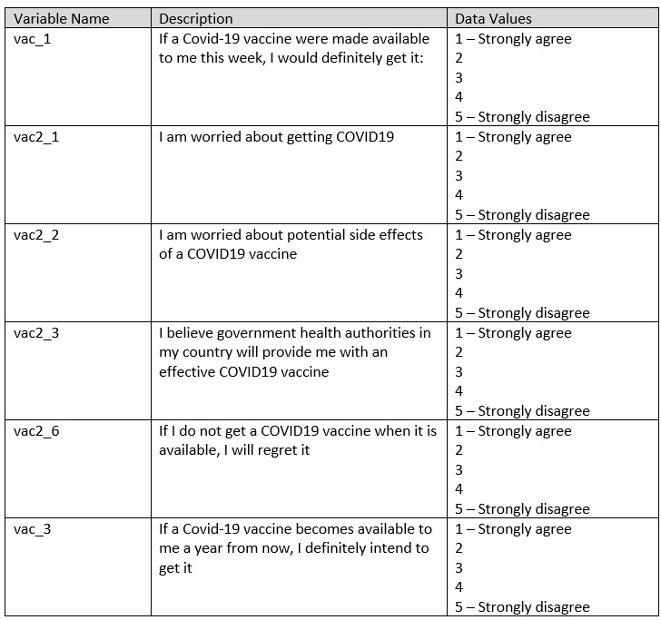
```


Demographical data such as gender, age, household sizes, employment status, and endtime were extracted as well to provide deeper understanding to the profile of the respondents.


```{r pressure4, echo=FALSE, fig.cap="Selected Demographic Variables", out.width = '100%'}
knitr::include_graphics("SelectedDemog.jpg")
```

For each of the country datasets, only the above selected fields were extracted from the original datasets. The below is a screenshot of the selected fields retained from the original country dataset.

```{r pressure5, echo=FALSE, fig.cap="Extracted variables from original dataset", out.width = '100%'}
knitr::include_graphics("D1_1.jpg")
```

### D1.2 Selection of relevant records

For the research, only data from January 2021 was used for analysis and visualization. As such, records of responses that were done in January 2021 were extracted from the dataset. This was done by first applying a date filter in the “endtime” column and selecting the relevant records as follow.

```{r pressure6, echo=FALSE, fig.cap="Date filter applied to extract Jan 2021 records", out.width = '100%'}
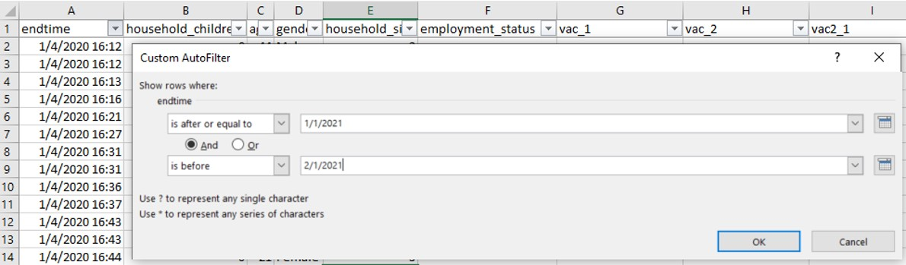
```

The following is a screenshot of the resulting dataset.

```{r pressure7, echo=FALSE, fig.cap="Remaining dataset after extracting Jan 2021 data", out.width = '100%'}
knitr::include_graphics("D1_2b.jpg")
```

### D1.3 Recoding of “1 – Strongly agree” and “5 – Strongly disagree”

For selected fields vac_1, vac2_1, vac2_2, vac2_3, vac2_6 and vac_3, 2 of the data values “1 – Strongly agree” and “5 – Strongly disagree” need to be recoded to numerical values 1 and 5 respectively.

This is done by using the Replace function as shown below

```{r pressure8, echo=FALSE, fig.cap="Replacement of 1 - Strongly agree using the Replace function", out.width = '100%'}
knitr::include_graphics("D1_3a.jpg")
```
and

```{r pressure9, echo=FALSE, fig.cap="Replacement of 5 - Strongly disagree using the Replace function", out.width = '100%'}
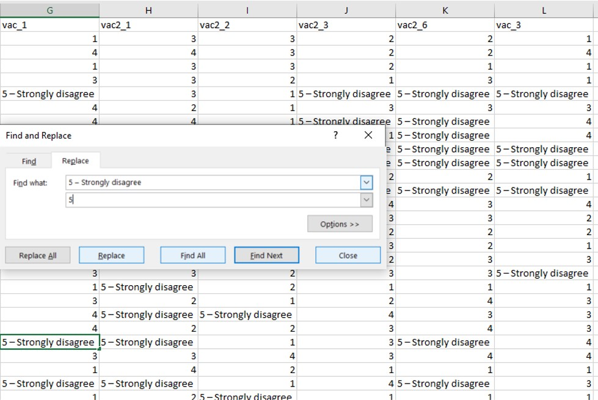
```

### D1.4 Recoding of values in household_children field

Based on the codebook provided (see below), there should not be entries with 7 or 8 in the “household_children” field as these would have been captured under “5 or more”. Rather 8 is supposed to be mapped to “Prefer not to say” and 7 is actually an invalid input value. In some of the countries’ datasets, this has not been properly coded (refer to diagram below).

```{r pressure10, echo=FALSE, fig.cap="Error in values of household_children", out.width = '100%'}
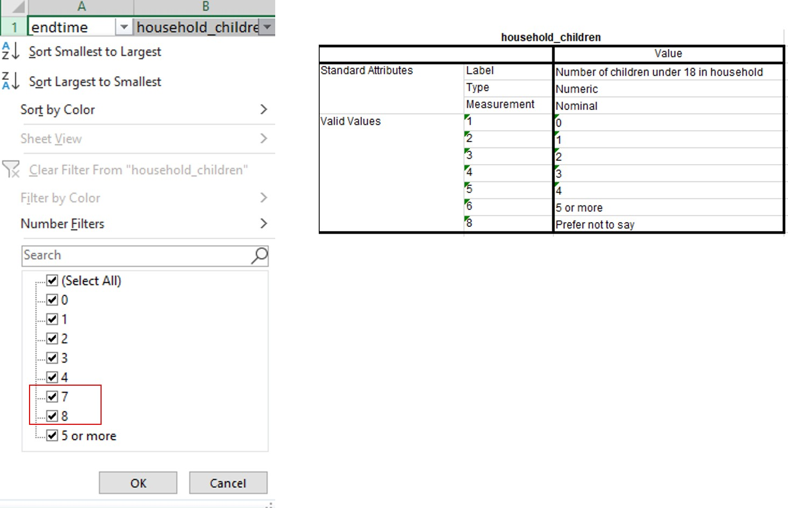
```
As such, values 7 and 8 will be recoded to “Don’t know” and “Prefer not to say” as aligned to the value labels in “household_size”. This is done through the use of the filter function as follow.

```{r pressure11, echo=FALSE, fig.cap="Rectified values of household_children", out.width = '100%'}
knitr::include_graphics("D1_4b.jpg")
```
### D1.5 Creation of employment_status field

For some of the country datasets, employment status is recorded in separate fields as shown in the following figure. 

```{r pressure12, echo=FALSE, fig.cap="Employment status recorded over separate variables", out.width = '100%'}
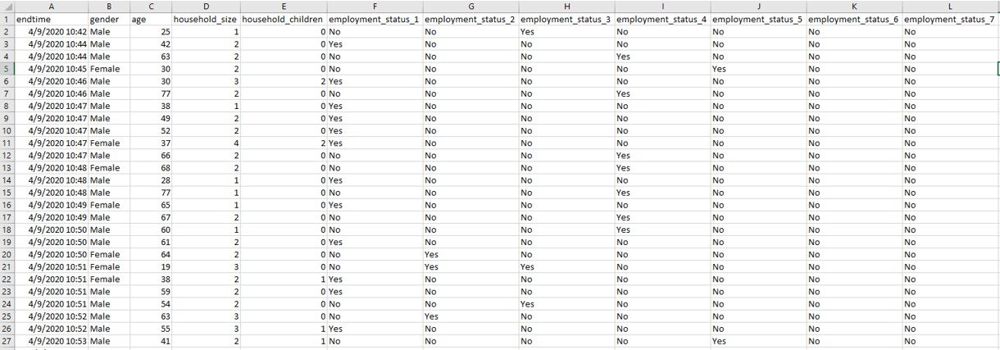
```
As such, a new field “employment_status” needs to be created to be consistent with the datasets of the other countries. The formula used to create the new field is as follows.

*=IF(G2="Yes","Full time employment",IF(H2="Yes","Part time employment",IF(I2="Yes","Full time student",IF(J2="Yes","Retired",IF(K2="Yes","Unemployed",IF(L2="Yes","Not working",IF(M2="Yes","Other",0)))))))*

```{r pressure13, echo=FALSE, fig.cap="Creation of employment_status field", out.width = '100%'}

```
The cleaned file is then saved with country name in Title case format.

The above steps are then repeated for each of the country datasets.

## D2. Creation of Diverging Stacked Bar Chart

### D2.1 Importing of Datasets into Tableau
All 14 country files were pulled into Tableau and a new column was created from Table Name via the split function to derive the Country variable.

```{r pressure14, echo=FALSE, fig.cap="Split function applied to Table Name field", out.width = '100%'}
knitr::include_graphics("D2_1_b.jpg")
```

```{r pressure15, echo=FALSE, fig.cap="Creation of Country field", out.width = '100%'}
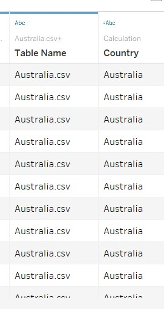
```

The responses to the various survey questions were then pivoted together into a single field as shown.

```{r pressure21, echo=FALSE, fig.cap="Pivoting of survey responses", out.width = '100%'}
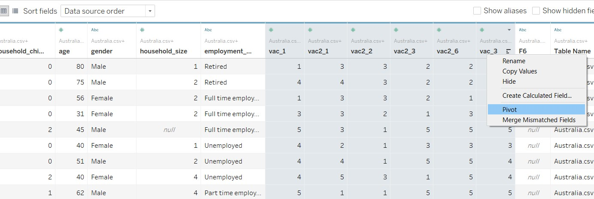
```

The pivot fields were then renamed to reflect the data they carry (i.e. Questions and Responses) as shown.

```{r pressure22, echo=FALSE, fig.cap="Renaming of Pivoted Fields", out.width = '100%'}
knitr::include_graphics("D2_1d.jpg")
```

### D2.2 Renaming of data values

For Response, the data currently are continuous data types. They were converted to Dimensions as follows.

```{r pressure23, echo=FALSE, fig.cap="Renaming of Pivoted Fields", out.width = '100%'}
knitr::include_graphics("D2_1e.jpg")
```
The data values in Response was then re-labelled with their aliases as shown below.

```{r pressure24, echo=FALSE, fig.cap="Editing aliases for Response field", out.width = '100%'}
knitr::include_graphics("D2_2a.jpg")
```

The data in Question field was renamed also to reflect the respective survey questions, for easy reference.

```{r pressure25, echo=FALSE, fig.cap="Editing aliases for Question field", out.width = '100%'}
knitr::include_graphics("D2_2b.jpg")
```

### D2.3 Creation of Calculated Fields

Calculated fields needed to be created via the Analysis tab as shown below.

```{r pressure26, echo=FALSE, fig.cap="Creation of Calculated Field", out.width = '100%'}
knitr::include_graphics("D2_2c.jpg")
```

Formulae for the respective calculated fields were input as shown below.

```{r pressure27, echo=FALSE, fig.cap="Creation of Number of Records field", out.width = '100%'}
knitr::include_graphics("D2_2d.jpg")
```

```{r pressure28, echo=FALSE, fig.cap="Creation of Total Count field", out.width = '100%'}
knitr::include_graphics("D2_3a.jpg")
```

```{r pressure29, echo=FALSE, fig.cap="Creation of Count Negative field", out.width = '100%'}
knitr::include_graphics("D2_3b.jpg")
```

```{r pressure30, echo=FALSE, fig.cap="Creation of Total Count Negative field", out.width = '100%'}
knitr::include_graphics("D2_3c.jpg")
```

```{r pressure31, echo=FALSE, fig.cap="Creation of Percentage field", out.width = '100%'}
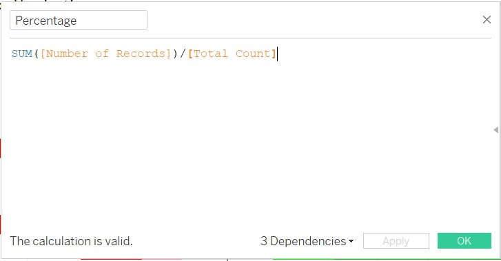
```

The Diverging Stacked Bar Chart is actually created using a Gantt chart concept. As such the start point of the Gantt chart is defined as follow.

```{r pressure32, echo=FALSE, fig.cap="Creation of Gantt start", out.width = '100%'}
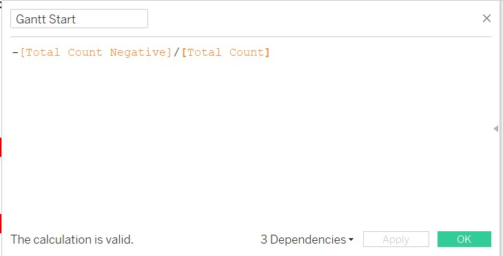
```

```{r pressure33, echo=FALSE, fig.cap="Creation of Gantt Percent", out.width = '100%'}
knitr::include_graphics("D2_3f.jpg")
```

```{r pressure34, echo=FALSE, fig.cap="Creation of Gantt Percent", out.width = '100%'}
knitr::include_graphics("D2_3f.jpg")
```

Bring Gantt Percent into columns, Country into Rows, Response to the Colour button and Detail button, and Percentage to Size button as shown. Ensure Gantt Percent and Percentage are computed using Response (refer to below).

```{r pressure35, echo=FALSE, fig.cap="Creation of Gantt Percent", out.width = '100%'}
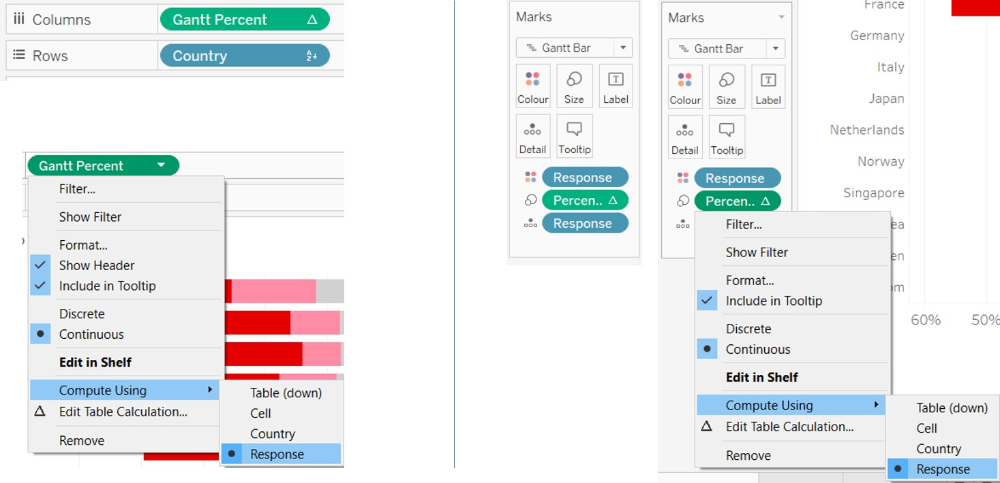
```


# E. Observations from the Proposed Data Visualization

**1.    United Kingdom (UK) had the greatest receptivity towards COVID-19 vaccination**<br>
From the figure below, it is observed that respondents from the UK were most inclined and receptive towards COVID-19 vaccination. France on the other hand, seemed to be the least receptive towards vaccination.


```{r pressure16, echo=FALSE, fig.cap="Inclination of countries towards vaccination", out.width = '100%'}
knitr::include_graphics("D5_1a.jpg")
```
**2.    Japan, not France, had the lowest proportion who strongly agreed that they were keen on vaccination**
From the chart on the right, it would seem that Japan was the least receptive towards the COVID-19 vaccine because of the lowest proportion that agreed strongly to the statement that they were keen on vaccination. However, by inspecting the chart on the left (refer to the orange boxes), it is interesting to note that France was less receptive because of the much larger proportion who strongly disagreed compared to Japan's. Hence while Japan had a smaller proportion who strongly agreed, they also had a smaller proportion who strongly disagreed compared to France. This is likely arising from cultural differences whereby Japanese are less strong in their opinions compared to the French (with the proportion who are Neutral being twice that of the French).

**3.    UK and Denmark had significantly higher proportion of respondents who strongly agreed that they were willing to be vaccinated**
From the chart above (refer to red box), it is observed that UK and Denmark were significantly higher than the other countries at the 99% confidence interval. Countries in the blue region did not have proportions that were statistically different at the 99% confidence level, based on their confidence intervals.

**4.    Worry of getting COVID does not seem to be a main reason for receptivity towards vaccination**
From the screenshot below (referring to the blue boxes), countries who were the most receptive towards vaccination did not have very high proportion of respondents who strongly agreed that they were worried about getting COVID-19. On the contrary, Japan which was one of the least receptive, had the highest proportion who strongly agreed they were worried about getting COVID-19. Netherlands and Finland had the lowest proportion who strongly agreed they were worried but their receptivity towards vaccines appear to be among the more receptive countries.

```{r pressure17, echo=FALSE, fig.cap="Vaccine receptivity and Worry of getting COVID-19", out.width = '100%'}
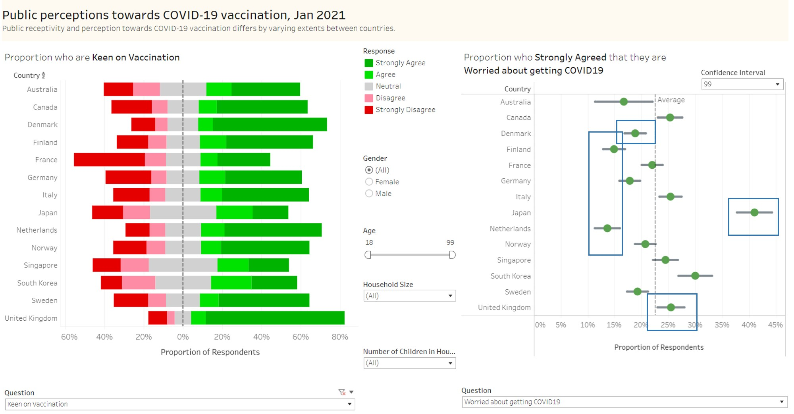
```

**5.    Worry about vaccine side effects seem to affect receptivity towards COVID-19 vaccination**
From the chart below, it is observed that countries that are more receptive towards vaccination (such as UK, Denmark and Netherlands) have lower concerns towards vaccine side effects. This is evident from the lower proportion of respondents who strongly agreed to the statement that they are worried about vaccine side effects (refer to blue boxes).

On the contrary, countries which are less receptive, have a higher proportion who strongly agreed that they were worried about vaccine side effects. These countries include France, Japan and Singapore.

```{r pressure18, echo=FALSE, fig.cap="Vaccine receptivity and Worry of vaccine side effects", out.width = '100%'}
knitr::include_graphics("D5_1c.jpg")
```

**6.    Confidence in health authorities providing effective vaccines seemed to be linked to vaccine receptivity**
In the chart below, with focus on the blue boxes, countries which had the highest receptivity towards vaccination (i.e., Denmark and UK) saw a higher proportion of respondents who strongly agreed that they were confident on effective vaccines being provided. The converse is true as well for countries who were least receptive (e.g., Japan and France)

```{r pressure20, echo=FALSE, fig.cap="Vaccine receptivity and Confidence in vaccine efficacy", out.width = '100%'}
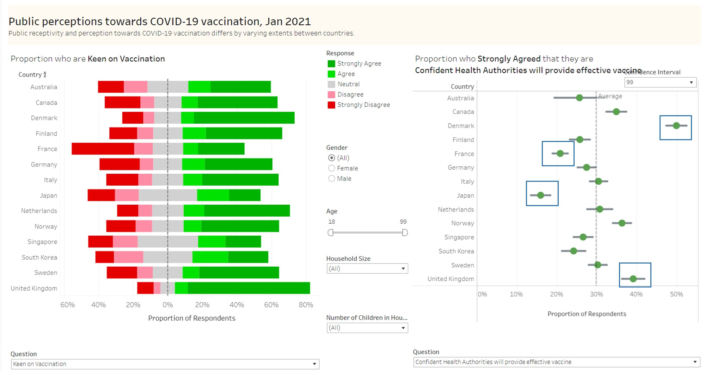
```

**7.    Age is an important factor in receptivity towards vaccine**
In the figure below, it is observed that in general and across all countries, the older population (aged 78-99 years) were much more receptive towards vaccination as compared to the younger respondents (aged 18-39 years).

```{r pressure19, echo=FALSE, fig.cap="Comparison of vaccine receptivity between age groups", out.width = '100%'}
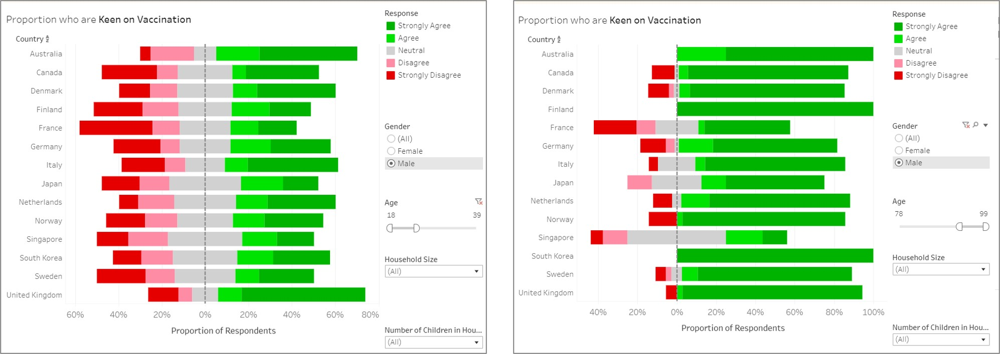
```

# Conclusion
In conclusion, the side by side comparison of responses, as well as the breakdown by demographic factors, does reveal interesting patterns of receptivity towards COVID-19 vaccination. Public health authorities would gain much from the close analysis of these factors in the planning of programmes and strategies to increase COVID-19 vaccination.